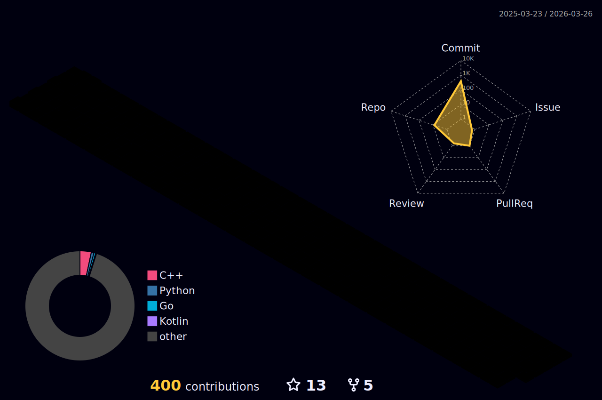

### Coding Hard to be a nice developer! 😄😄😄

### Currently I am...
- Student of Hanyang Univ. (Senior)
- Working as a Full-Stack Developer, expanding my roadmaps to DevOps.

### Tech Stacks

#### Languages

    
    

 

#### Frontend & Application

    
    
    

 

#### Backend

    
    
    
    

 

#### Infra

    
    
    

 

#### Monitoring & MSA

    
    
    
    
    

 

#### Currently Studying (Future Roadmap)

    
    
    
    
    
    
    
    

<!--

**KyumKyum/KyumKyum** is a ✨ _special_ ✨ repository because its `README.md` (this file) appears on your GitHub profile.

Here are some ideas to get you started:

- 🔭 I’m currently working on ...
- 🌱 I’m currently learning ...
- 👯 I’m looking to collaborate on ...
- 🤔 I’m looking for help with ...
- 💬 Ask me about ...
- 📫 How to reach me: ...
- 😄 Pronouns: ...
- ⚡ Fun fact: ...
-->
