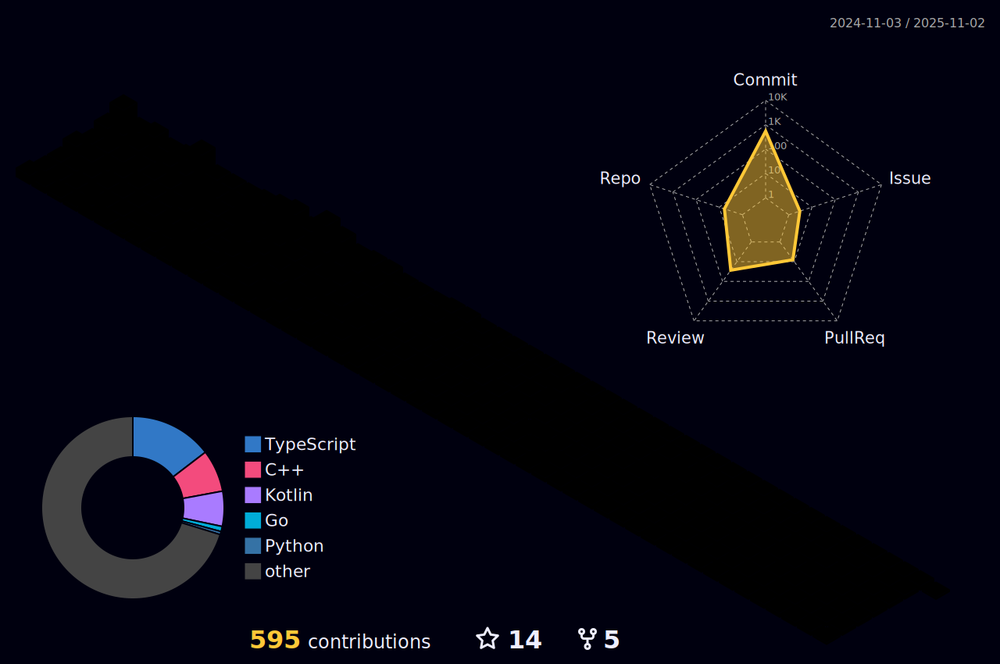

#### Coding Hard to be a nice developer! 😄😄😄

#### Currently I am...
- Student of Hanyang Univ. (Junior)
- Working as a Full-Stack Developer.

#### Tech Stacks

    
    
    
    
    
    
    
    
    
    
    
    
    
    
    
    
    
    

 

###### I usually...
- Build Frontend with...
    - React.js using Javascript or Typescript. (Currently migrating all dev works to typescript.)
 
- Build Backend with...
    - Express.js using Javascript/Typescript with GraphQL.
    - Spring boot using Kotlin with REST API.
    - Golang with gRPC for build microservices. (Framework will be varied by the situation.)
    - Mostly using PostgreSQL as main DB, Cassandra as log DB.
    - Also trying to apply Redis as a cache.
      
- Build Application with...
    - RN using typescript. (Still working hard on it...)
      
- Currently trying to study and learn...
    - More about Kotlin and Spring Boot. (or Spring-Like architecture, just like MVC or Hexagonal Architecture)
    - More about Typescript and Golang.
    - Trying to learn framework Next.js and Nest.js.
    - Trying to learn a little bit of Rust. (Not deeply, but just the concept. I guess 'thinking like a rust' will greatly helpful when developing!)

<!--

**KyumKyum/KyumKyum** is a ✨ _special_ ✨ repository because its `README.md` (this file) appears on your GitHub profile.

Here are some ideas to get you started:

- 🔭 I’m currently working on ...
- 🌱 I’m currently learning ...
- 👯 I’m looking to collaborate on ...
- 🤔 I’m looking for help with ...
- 💬 Ask me about ...
- 📫 How to reach me: ...
- 😄 Pronouns: ...
- ⚡ Fun fact: ...
-->
